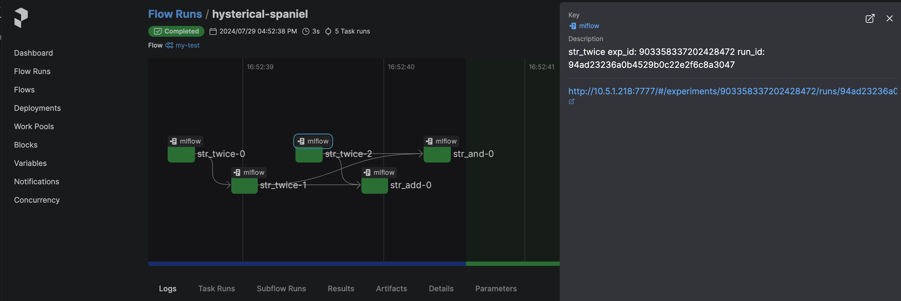

# task_mlflow_wrapper

This is the wrapper of `@task` decorator defined in `prefect` library.
The `@task_with_mlflow()` decorator enables to log the inputs, returned value, and artifacts to `mlflow`

The task flow can be visualized by the prefect, and the link to each log of the function is available.

## install 

We recomend to separate the environments by using `venv` or other systems.

```
pip install git+https://github.com/YukiSakamoto/task_mlflow_wrapper.git
```

By using above command, the `prefect` and `mlflow` libraries will also be installed.

## Example code

test.py

```python
import prefect
from prefect import flow
from task_mlflow_wrapper import task_with_mlflow

@task_with_mlflow()
def str_twice(s):
    return s*2

@task_with_mlflow()
def str_triple(s):
    return s*3

@task_with_mlflow()
def str_add(s1, s2):
    return s1+s2

@task_with_mlflow()
def str_and(s1,s2):
    return s1 and s2

@flow()
def my_test(a = "hello", b = "byebye"):
    a = str_twice(a)
    aa = str_twice(a)
    bb = str_twice(b)
    ret = str_add(aa,bb)
    print(ret)
    ret2 = str_and(aa, bb)
    print(ret2)
    return ret

if __name__ == '__main__':
    my_test()
```

```
python test.py
```

## Browse

To see the results in the dashboard on your webbrowser, the servers must be started. 
These servers must be run on the same directory where your code is executed.

### Launch Prefect
```
prefect server start --host 10.5.1.218
```

### Launch mlflow

```
mlflow server --host 10.5.1.218:7777
```

After launching the server applications, the dashboard of the prefect will be available.
Please open 10.5.1.218:4200 in your webbrowser.


